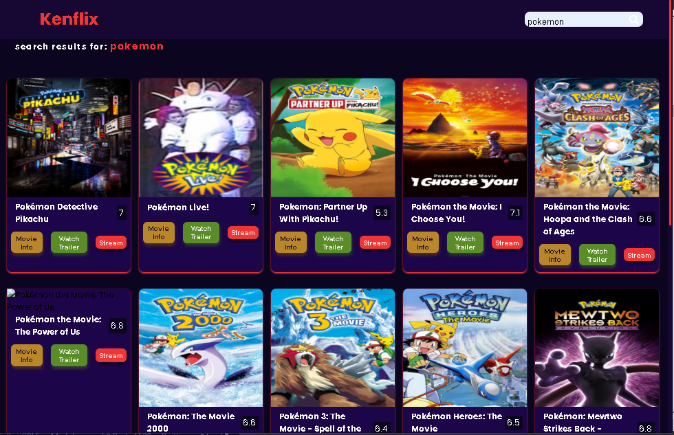

# Movie App
**This is a web application that show directories of movies making use of movies data, provided by TMDB.**
- Author: Kehinde Ojapa
- Github: https://github.com/kehindeojapa-dev
- Demo Link: 
- API used: TMDB

### Features:
- **Movie Category:** App contains categories of movie including: latest movies, action, romance, comedy, horror, sci-fi and animations.
  

- **Search functionality:** Using a search form, result shows movies related to the searched term.

 

- **Movie Info:** Extra information about the movie is shown, and also the major actors that appeared in the movie.
  

- **Stream:** This feature allows you to stream selected movie in a streaming site(azm.to). 

- **Watch Trailer:** This feature takes you to YouTube to watch the trailer of the selected movie.
  